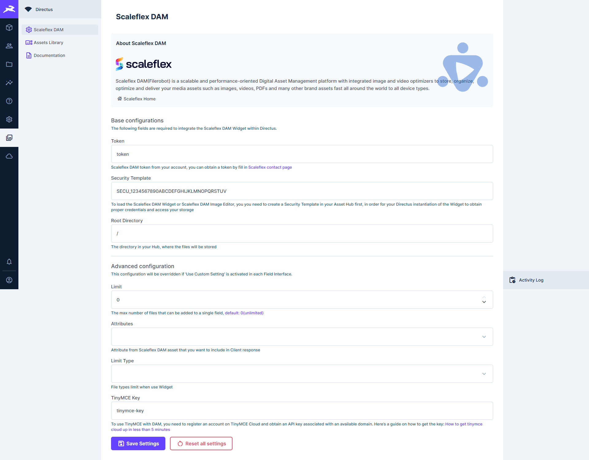
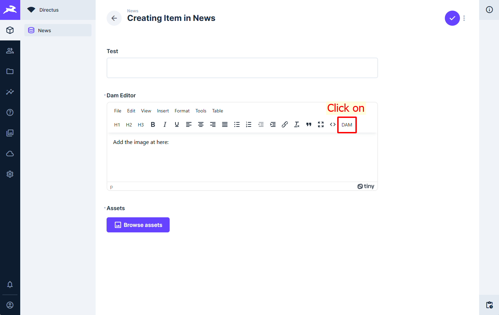

# Scaleflex DAM
## Installation
### Prerequisites
* [**Register for a demo**](https://www.scaleflex.com/request-a-demo) if you don't already have a Scaleflex DAM account.
* Need to add a config CONTENT SECURITY POLICY to your .env file
```dockerfile
# Dot version
CONTENT_SECURITY_POLICY_USE_DEFAULTS: true
CONTENT_SECURITY_POLICY_DIRECTIVES__SCRIPT_SRC: "'self','unsafe-eval',*.scaleflex.com,cdn.tiny.cloud"
CONTENT_SECURITY_POLICY_DIRECTIVES__IMG_SRC: "'self',data:,blob:,https://raw.githubusercontent.com,https://avatars.githubusercontent.com,*.filerobot.com,*.tinymce.com"
CONTENT_SECURITY_POLICY_DIRECTIVES__MEDIA_SRC: "'self', *.filerobot.com"
```
### Step 1: Install the extension
### Step 2: Active the Scaleflex DAM extension
Click on **"Settings"** on the left menu and after that click **"Extensions"** on the sub-menu.


### Step 3: Show the extension on the left menu
Click **"Settings"** on the left menu and then click **"Settings"** on the sub-menu.
Scroll to block **Modules** and check two items **"Scaleflex DAM Settings"** and **"Scaleflex DAM"**


### Step 4: Fill in your configuration



* **Token:** Enter your Scaleflex DAM token here (eg: abcdefgh).
* **Security Template:** To load the Scaleflex DAM Widget, you must create a Security Template in your Scaleflex DAM Hub.
* **Root directory:**  The directory in your Scaleflex DAM account, where the files will be stored.

#### Advanced Configuration
* **Limit:** The maximum number of files that can be added to a single field, default: 0 (unlimited).
* **Attributes:** Attribute from Scaleflex DAM asset that you want to include in Client response.
* **Limit Type:** File types are limited when using Widget.

## How to use Scaleflex DAM field?
**1/** Create a new field **"Scaleflex DAM"**


**2/** Select your display type
On the list fields, select the new field just created. On the tab **"Display"**, choose **"DAM Assets"**.


**3/** Go to your content Model and you will see the new field just created. Click on **"Browse Assets"** to select the assets in **Scaleflex DAM**


The result displayed after adding the assets


You can modify the image by clicking on **"Show variants"** to resize or crop the image.

 

In the list of items


## Advanced Configuration Display
You can set the limit asset showing in the list of items.
In the **Field Settings**, click on the tab **"Display"** and choose **DAM Assets**. Input the limit items you want to show in the list.


## Using TinyMCE Editor with Scaleflex DAM
**1/** Create a new field **"WYSIWYG with Scaleflex DAM"**


**2/** Using the editor, click on the button **"DAM"** to add the asset to your content.
Support image, video, and audio.



